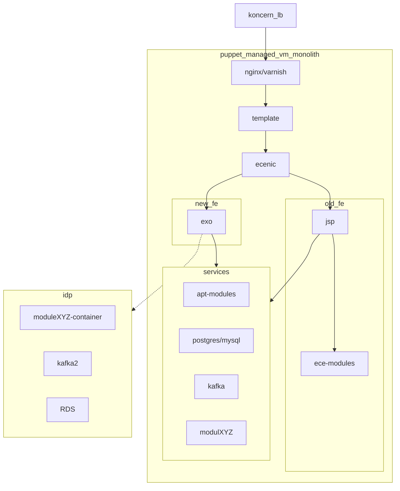

Here is a flowchart for Politiken with IDP migration path - near-identical for dev, test and prod environments:

## **Formål**

Politikens udviklere ønsker at forberede sig på fremtidigt samarbejde med IDP.

0. IDP stiller cluster til rådighed pr. 1. marts med gængse leverancer - monitorering, argoCD, auth osv
0. Formålet er at Politikens udviklere kan blive klogere på kubernetes, helm, ways of working med IDP - der bør minimum være templates og basic forklaring af argo/helm/deploy pipelines etc.
0. Politiken ønsker at migrere services fra apt-pakker (vmware ubuntu linux) til containers (ex. postgres, kafka, nginx, varnish, ignite mv) og fra ecenic til containers (ex. bloomreach mv)
0. Politikens udviklere driver og vedligeholder selv disse services (hvilket bør være en mindre byrde i forhold til nu, hvor de vedligeholder pakker og services og releaser i komplicerede flows på tværs af ecenic/vmware/puppet) 
0. IDP miljø bruges initielt til at afvikle moduler/containere, som vmware monolitten i dag indeholder, og som idag tilgås via localhost (fremover https) 
0. IDP team skal afklare optimal løsning på kommunikation mellem vmware og AWS
0. IDP team afsætter 1 møde ugentligt, og 1 person som kontaktperson til rådgivning og feedback, uden SLA - best effort.
0. IDP arbejder med Politikens udviklere med henblik på optimale workflows og gyldne stier.
0. Det forudsættes at Politikens udviklere betragter miljøet som beta - alt kan ændre sig. 

0. Tilgængelig SLA tidligst Q4/Q1 2025

## Intro møde  28/11-2024
Indledende snak om POL vs IDP
Jonas Tækker, Kasper, Kristoffer, Morten, Allan

## Afklarende møde 5/12-2024
Jonas, Kristoffer

Kristoffer laver oplæg der skal muliggøre POL kan forberede sig på IDP

