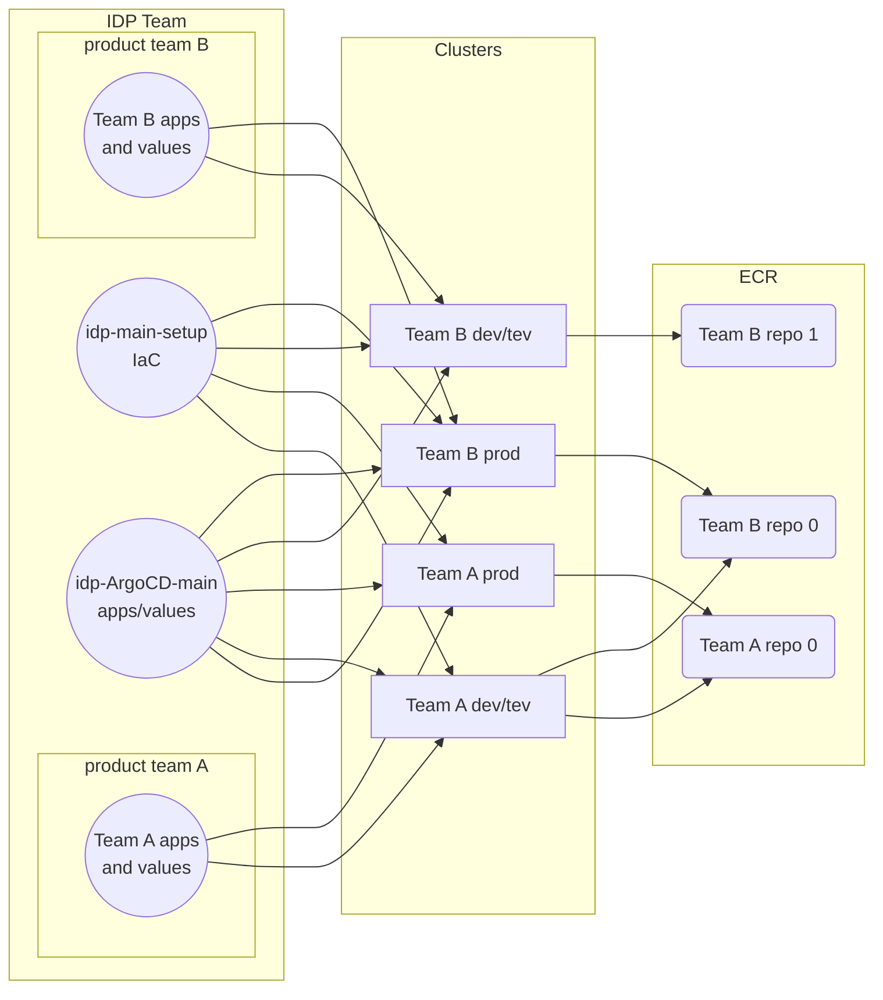

# Overall architecture discussions
## 20241217

Kasper, Kristoffer, Nicolaj, Morten 
# Purpose 
- Agreeing on overall distribution of configuration between git repositories. 
- Discussing intended Route53 structure and obstacles when migrating KOA and others
- Dev/test/prod environments pr product team 
- Defining helm repos and docker repos for idp clusters. 

# Infrastructure configuration

We have agreed to keep basic infrastructure as a mono-repo, defining account access, eks clusters and route53 records controlled by idp. 
Basic infrastructure is maintained at `jppol-idp/idp-main-setup`. 

This repo must enable us to setup the minimum requirements for running a cluster. That is defining EKS, DNS records, basis access 
rights on AWS level etc. 

We should also be able to define additional resources, not provided by an operator inside the EKS cluster. When such resources are
considered a part of the core IDP offering, we should create reusable OpenTofu modules. When something is ad-hoc, we can script it 
in whatever way possible. 

Additional resources can also be created in repositories maintained entirely by the user teams. We can grant access to all repositories 
pr idp-maintained account when agreed between user teams and idp teams. We will not provide any access to idp-main or idp-shared to external 
accounts or users. 

`idp-main-setup` is considered cluster bootstrapping leaving as much daily operations of the cluster as possible to ArgoCD. 

### Github
`idp-main-setup` also allows creation of Github repositories with secrets stored in secrets manager in product team AWS accounts where
they can be linked to each cluster secrets operator. We also craete webhooks with connection to the clusters ArgoCD. (These are currently
features in the making. IDP-100)

# ArgoCD 

Configuration in `idp-main-setup` provides the means necessary to bootstrap an IDP cluster running ArgoCD. The cluster is sectioned into 
a number of namespaces of which some are only visible to IDP team and others are visible to the users. 

We use ArgoCD to start services and application, and distritbute the setup between different repos.

## IDP space 
All clusters share one repository defining the core ArgoCD setup defining shared tooling like Grafana, External-DNS, Ingress/Gateway API,
 Loki etc. This definition is maintained in a single repository to allow redefining helm charts, settings and installation for all clusters 
in a centralized manner. 

The repo also contain value files and other setting pr cluster, defined in a simple folder structure inside the repo. 

The EKS setup in idp-main-setup should ensure that ArgoCD listens to the centraliced Argo config repository.

Each cluster-specific folder then directs some namespace(s) for each cluster, to additional github repositories that are fully accessible 
to the product teams using the platform. These repositories will allow product teams to define their own helm charts and - most notably - 
various application defined and run by themselves. 

## User space 
Each team is provided one or more repositories, that are linked to their clusters. These repositories will contain a folder structure 
that allows feature to define what should be running in their namespaces inside each cluster. The repos are linked to the clusters
using common github webhooks defined in idp-main-setup.

# ECR 
We use ECR for storing both helm charts and docker images. Everything must be stored inside ECR in the jppol-idp-shared account (354918371398). 

The repos should be defined inside idp-main-setup and pushing images and charts should happen from github actions authorized by OICD. 

We will need a list of repos used and can grant access to repos created both by the IDP team or by the product teams. 

When repos are created access to reading and writing each repo is granted to accounts resource policies. It is then possible to allow other 
accounts to use certain elements without allowing the accounts to modify them. 

# Environments
Each product team needs to get access to dev, test and production environments. 

Furthermore it can be necessary to create additional test endpoints for specific features inside an 
environment. In this case the application (container) will likely be configured with different 
configurations/feature flags, but reuse with other services and databases in the cluster.

We expect to host dev and test environments in the same cluster and differentiate on namespaces. 

# DNS 
We anticipate a number of situations with regards to DNS. 

1. Fully controlled operated by IDP
2. Host names are maintained in zones created by IDP, but not predictable from cluster setup
3. Zones are hosted outside IDP and names are matched to services in an non-predictable manner. 

## 1. Predictable zones maintained by IDP
In the least complex scenario we define a host name for each cluster, which acts as a superdomain 
for all network exposed services running inside the cluster. These names will have the format 

`<<service-name>>.<<cluster-name>>.idp.jppol.dk`

The idp-shared account maintains idp.jppol.dk, which delegates the proper sub domain the cluster 
which maintains its own zone <<cluster-name>>.idp.jppol.dk. 

When a service needs a subdomain, the cluster can simply create it, and will also be able to respond 
to cert challenges from Letsencrypt, ACM and others. 

From an IDP perspective - and likely also to the customer - this is the simplest and most desirable 
situation. 

The DNS names might however not be fitting for human readability and will contain little brand recognition. 

When migrating already running systems, these automatic DNS might not be suitable either. 

## 2. aliases on a zone controlled by IDP
Services may need to answer on alias names if clients are configured to use existing dns names and 
cannot easily change their endpoint, or if the service is an active website where the domain 
name has some kind of brand value. 

Under some circumstances it might be enough to have the owner of the old zone create some kind of 
redirect to a new dns name, but we must also be able to handle DNS aliases on the loadbalancer/GatewayAPI/Ingress
level. That is: We must be able to route traffic correctly even for domain names that are not sub domains
on the clusters standard domain. (IDP-101)

This includes proper certificate binding. 

### Certificate challenges
When we control the zone, it might be possible to respond to certificate challenges from Letsencrypt. 
We might also choose to use ACM and static DNS text records to validate domain ownership. 

## 3. Aliases on external zones
When IDP cannot administrate the zone for some reason, we should establish a common way of creating 
needed records in the zones. Likely ownership is either KIT (which we can already change using PRs), 
JP or POL. EB has at least some of their zones in a KIT repo. 

We should identify owners of relevant zones and hopefully at least get access to create PRs to their 
definitions. 

We should also agree if we should offer to revert the process and take control of the zone allowing 
currrent owners to create PRs to the zones.  

## Handling the various DNS scenarios
We hope to be able to persuade KOA to only use predictable DNS names (case 1 above) when we create their
dev environment. 

When we reach test - and of course production - we will need to have the functionality to handle  
request routing and issue certificates for other zones as well. 

(IDP-101, IDP-102)

# Databases and migrations (RDBMS)
We should provide an optional database server for each _environment_ or perhaps each cluster. 

We should support both (and preferably) Postgres and MSSQL. Patching and backup/restore procedures 
are the responsibility of the IDP team, but will not be formalized and tested until we reach 
test maturity on the clusters. 

We have seen a pattern where each service spawns its own (very small) database server, which to 
us seem like a dubious approach. We will have to investigate into the rationale behind this decision
but expect to run RDS instances shared by many services. 

## Migrating services 
While migrating from non-idp accounts to IDP it may be necessary to make vpc peering and 
access database servers on other accounts during migration. 

As the migration is not done until databases are migrated, we will have to perform a migration 
sooner or later, why we must balance the difficulties in cross team cross account vpc peering 
with creating various migration setups in the first hand. VPC peering might be necessary 
to be able to get applications up-and-running in dev during january. 

## Database migration 
Migrating databases will always be difficult. Migrating them without down time in a maintenance 
window may be close to impossible. But the strategies are roughly as follows: 

- Use AWS DMS and setup a replication of the source databases to a target database in the idp child account
- Migrating using RDS Snapshot and restore to new server: https://docs.aws.amazon.com/prescriptive-guidance/latest/patterns/migrate-an-amazon-rds-db-instance-to-another-vpc-or-account.html
- Regular full "backup and restore"

## Handling schemas
When talking to KOA it is obvious that we cannot expect one single way of maintaining database schemas.
We will need to work with the customers to provide needed tools for database maintenance. 

## Database access 
KOA has already expressed a desire to be able to access databases and possibly also perform data 
maintenance (inserts, updates, deletes) in production. 

This is imposes some technical issues in providing vpn or similar access to RDS vpcs, and also contains 
issues with granting access to databases in production. It should however be noted, that the ways-of-working 
in jppol mostly have permitted developers access to databases why it is probably necessary to allow this. 

It also seem that a few of KOAs databases get schema maintance på sql console. 
